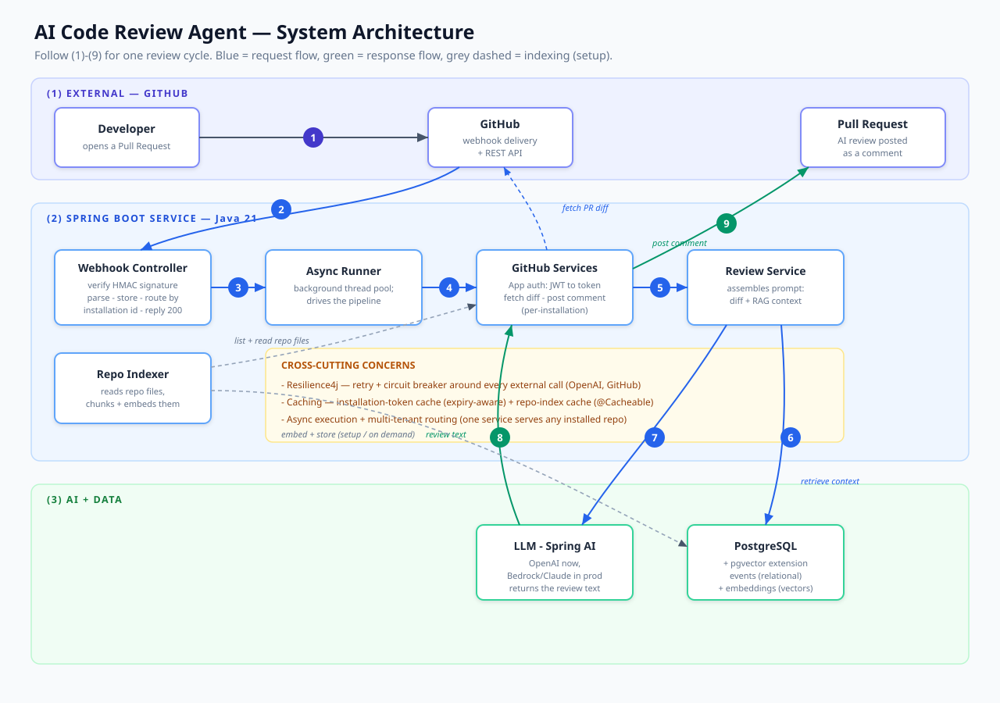

# ✨ AI Code Review Agent

An autonomous GitHub App that reviews pull requests with an LLM — and, crucially, uses **retrieval-augmented generation (RAG)** over the repository to catch **cross-file defects** that diff-only review misses (a broken caller, a changed contract, a signature mismatch in a file the diff never shows).

Built in **Java 21 / Spring Boot 4** with **Spring AI**, **pgvector**, and a resilient, multi-tenant, fully containerized architecture.

> **Why this exists:** most LLM code reviewers only see the diff. That makes them structurally blind to breakage whose evidence lives in *another* file. This agent retrieves the relevant surrounding code first, so it can see the break coming — and an accompanying empirical study measures exactly how much that helps.

---

##  What it does

1. A developer opens a pull request on a repo where the app is installed.
2. GitHub sends a webhook; the app verifies its authenticity (HMAC signature).
3. The app authenticates as a **GitHub App** (JWT → per-installation token) and fetches the PR diff.
4. It **retrieves related code** from the repository via vector similarity search (pgvector) — the RAG step.
5. It sends *diff + retrieved context* to an LLM (**Spring AI**) for review.
6. It posts the review back onto the PR as a comment — automatically, within seconds.

All the slow work runs **asynchronously** on a background thread pool, so the webhook responds instantly and GitHub never retries.

---

##  Architecture



Three layers: **GitHub** (external), the **Spring Boot service** (webhook handling, GitHub App auth, async orchestration, review logic), and **AI + data** (the LLM provider and PostgreSQL/pgvector storing both relational events and vector embeddings). Solid arrows are the request path; dashed arrows are supporting/data calls.

---

## 🔬 The research angle: does RAG actually help?

This isn't just a product — it's backed by a controlled empirical study measuring RAG's effect on review quality.

**Method:** a benchmark of **80 seeded-defect instances across 10 repositories** (Java + Python), each reviewed twice — once **diff-only** (no-RAG) and once **with retrieved context** (RAG) — scored by an LLM-as-judge that was **human-validated** (Cohen's κ = 0.60).

**Key result:**

| Metric | NO-RAG (diff only) | RAG (with context) |
|---|---|---|
| **Cross-file defect recall** | 74.4% | **100%** |
| Overall recall | 73.4% | 92.2% |
| False-positive rate | 43.8% | 68.8% |

RAG caught **every** cross-file defect (McNemar p = 0.001, large effect size) — a statistically significant improvement — **but** at a measurable cost: a higher false-positive rate. The honest takeaway: **RAG's benefit is concentrated in cross-file defects and should be applied selectively, not universally.**


---

##  Tech stack

- **Language / framework:** Java 21, Spring Boot 4.1
- **AI:** Spring AI (OpenAI now; provider-swappable to AWS Bedrock)
- **Vector store:** PostgreSQL + pgvector (HNSW index, 1536-dim embeddings)
- **GitHub integration:** GitHub App (JWT auth, per-installation tokens, HMAC-verified webhooks)
- **Resilience:** Resilience4j (retry + circuit breaker on every external call)
- **Performance:** async thread pool, expiry-aware token caching, `@Cacheable` repo indexing
- **Multi-tenancy:** one running service reviews PRs on *any* repo it's installed on, routed by installation id
- **Packaging:** Docker + Docker Compose (app + pgvector, one command)

---

##  Run it locally

The whole system runs in Docker — no manual Postgres or pgvector install needed.

### Prerequisites
- Docker Desktop
- An OpenAI API key
- A registered GitHub App (for live PR reviews) with its private key

### 1. Configure secrets
Create a `secrets/` directory and place your GitHub App private key (PKCS#8) inside:
```
secrets/github-private-key-pkcs8.pem
```
Export your OpenAI key:
```bash
export OPENAI_API_KEY="sk-..."
```

### 2. Launch
```bash
docker compose up --build
```
This starts the app and a pgvector-enabled PostgreSQL, wired together. The app comes up on `http://localhost:8080`.

### 3. Configuration
All settings are environment-driven (12-factor). Key variables:

| Variable | Purpose | Default |
|---|---|---|
| `OPENAI_API_KEY` | LLM access | — (required) |
| `SPRING_DATASOURCE_URL` | Postgres URL | `jdbc:postgresql://db:5432/pr_review_agent` |
| `GITHUB_APP_ID` | Your GitHub App id | — |
| `GITHUB_APP_INSTALLATION_ID` | Default installation | — |
| `GITHUB_WEBHOOK_SECRET` | Webhook HMAC secret | — |
| `GITHUB_PRIVATE_KEY_PATH` | Path to PKCS#8 key | `/run/secrets/...` |

---

## Engineering highlights

Some of the harder problems solved along the way (documented in depth in the project notes):

- **GitHub App two-hop auth** — signing a JWT with an RSA private key, exchanging it for a short-lived per-installation token, with expiry-aware caching.
- **Multi-tenancy** — the webhook carries an installation id; the app mints and caches a token *per installation*, so one deployment serves any repo it's installed on.
- **RAG over code** — chunking + embedding repository files into pgvector, then similarity-searching the diff to surface the code most likely to break.
- **Resilience** — retry with backoff and circuit breakers wrap every external call, so a transient OpenAI/GitHub blip doesn't fail a review.
- **Reproducible-config design** — every secret and environment-specific value is injected at runtime; the built image contains zero secrets.

---

## 📄 License

MIT — see [LICENSE](LICENSE).

---

*Built as a deep-dive into production-grade LLM application engineering: GitHub App internals, RAG over code, resilience patterns, and rigorous empirical evaluation.*
